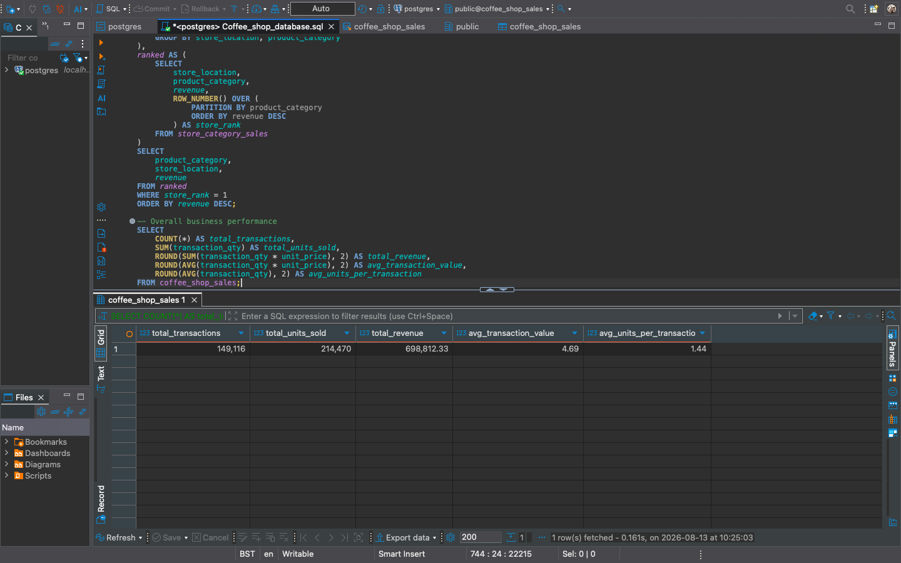
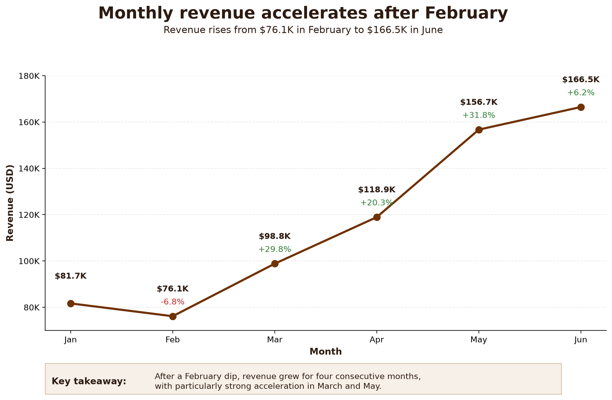
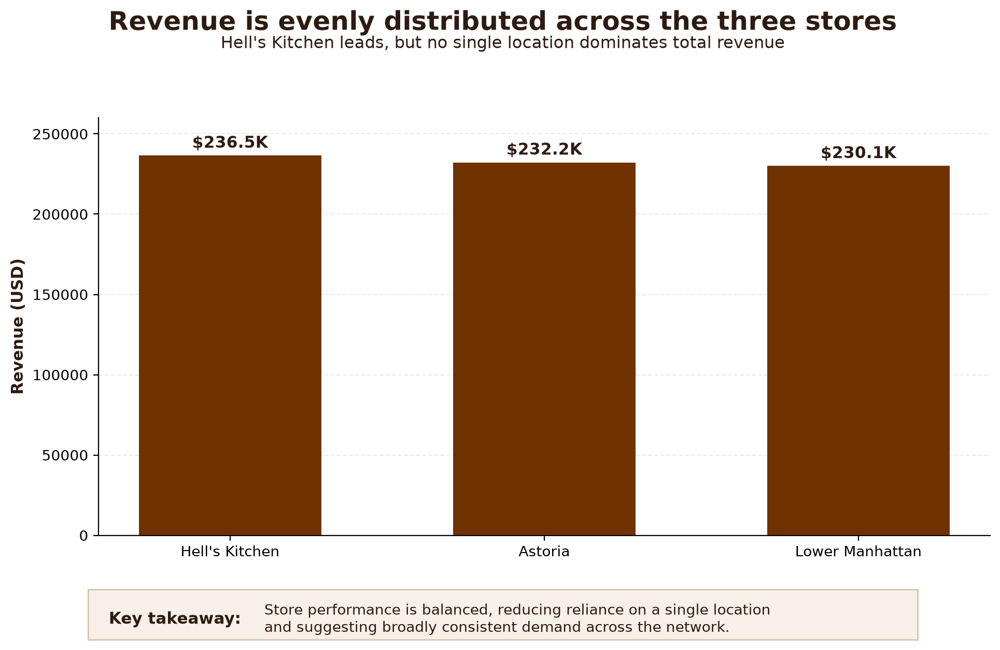
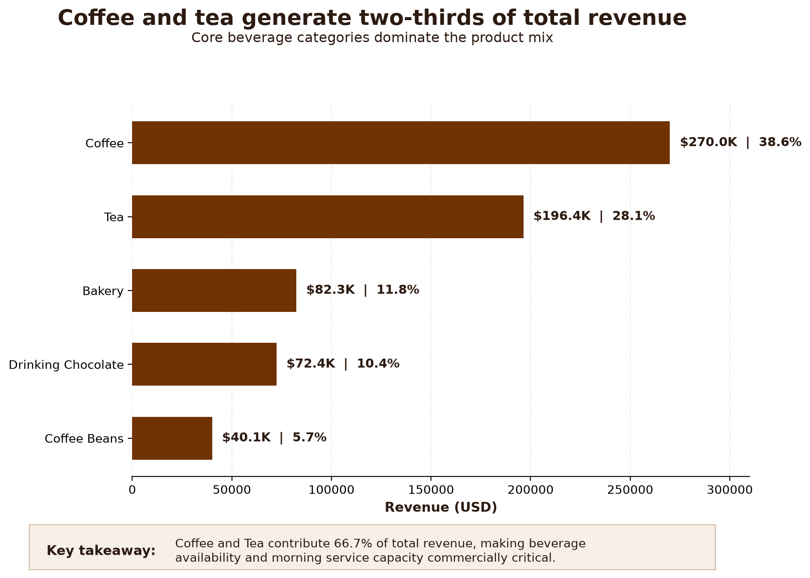
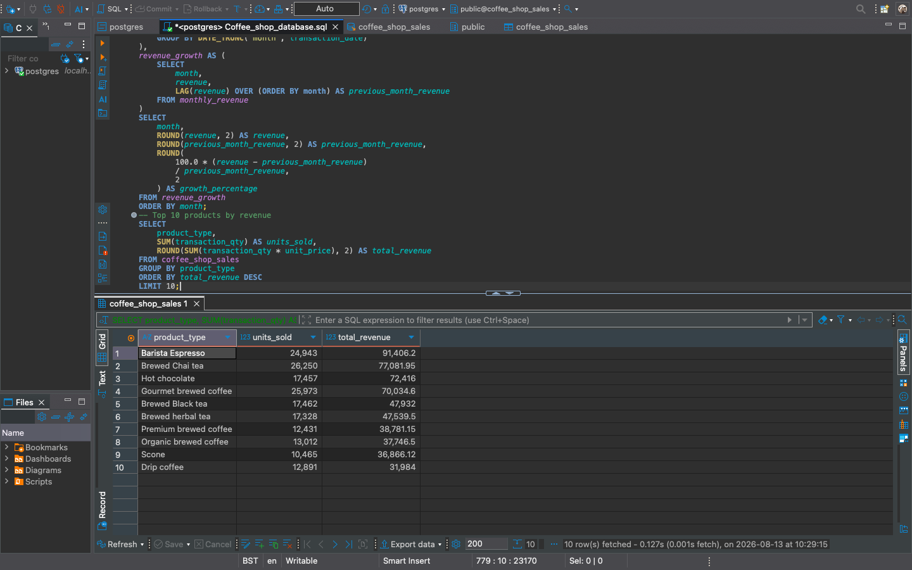

# ☕ Coffee Shop Sales Analysis

## Project Overview

This project analyses transactional sales data from three coffee shop locations using **PostgreSQL and Python**.

The objective was to transform raw transaction data into meaningful business insights by examining overall sales performance, store performance, monthly revenue trends, customer purchasing behaviour, and product performance.

The project combines SQL-based analysis with Python visualisation to demonstrate an end-to-end analytical workflow: from validating and querying transactional data through to communicating findings and business recommendations.

### Key Results

- **$698.8K** total revenue
- **149,116** transactions
- **214,470** units sold
- Revenue increased from **$81.7K in January to $166.5K in June**
- **Coffee and Tea generated 66.7% of total revenue**
- Revenue was distributed relatively evenly across the three store locations
- **Barista Espresso** was the highest-revenue product type

---

## Business Questions

The analysis was designed to answer the following questions:

- How much revenue did the coffee shop generate?
- How many transactions and units were sold?
- Which store generated the most revenue?
- How did revenue change over time?
- Which months performed best?
- What times of day generated the most sales?
- Which product categories contributed the most revenue?
- Which individual products generated the most revenue?
- Which stores performed best within different product categories?
- Where might there be opportunities to improve commercial performance?

---

## Dataset

### Data Source

The dataset was obtained from the **Maven Analytics Coffee Shop Sales dataset**.

The original data was supplied as an Excel workbook and converted to CSV format before being loaded into PostgreSQL.

The dataset contains transaction-level sales records covering **1 January 2023 to 30 June 2023** across three New York coffee shop locations:

- Astoria
- Hell's Kitchen
- Lower Manhattan

Important fields used in the analysis include:

- `transaction_id`
- `transaction_date`
- `transaction_time`
- `transaction_qty`
- `store_location`
- `product_category`
- `product_type`
- `product_detail`
- `unit_price`

---

## Tools & Skills

### Technologies

- PostgreSQL
- DBeaver
- Python
- pandas
- Matplotlib
- Git
- GitHub

### SQL

- Aggregate functions
- Common Table Expressions (CTEs)
- Subqueries
- Window functions
- `LAG()`
- `ROW_NUMBER()`
- `RANK()`
- `PARTITION BY`
- Conditional logic with `CASE`
- Date and time analysis
- Percentage calculations
- Month-over-month growth calculations
- Data quality checks

### Python & Visualisation

- Data manipulation with pandas
- Data visualisation with Matplotlib
- Business-focused chart design
- Data labelling and annotation
- Reproducible visualisation scripts

### Analytical Skills

- Sales performance analysis
- Trend analysis
- Product performance analysis
- Store performance comparison
- Customer purchasing pattern analysis
- Translating analytical findings into business recommendations

---

# Analysis

## 1. Data Quality Checks

Before performing the analysis, the dataset was validated to ensure the results were reliable.

Checks included:

- Total row count
- Unique transaction IDs
- Missing values in key columns
- Transaction date range
- Transaction quantity range
- Unit price range

The dataset covers transactions between **1 January 2023 and 30 June 2023**.

These checks helped verify that the core fields required for the analysis were suitable for further exploration.

---

## 2. Overall Sales Performance

Across the six-month period, the business generated:

| Metric | Result |
|---|---:|
| Total Transactions | 149,116 |
| Total Units Sold | 214,470 |
| Total Revenue | $698,812.33 |

These metrics establish the overall scale of sales activity across the three locations.



---

## 3. Monthly Revenue Trend

Monthly revenue was analysed to understand how business performance changed during the first half of 2023.

| Month | Revenue |
|---|---:|
| January | $81,677.74 |
| February | $76,145.19 |
| March | $98,834.68 |
| April | $118,941.08 |
| May | $156,727.76 |
| June | $166,485.88 |



Revenue declined slightly from **$81.7K in January to $76.1K in February**, before increasing for four consecutive months and reaching **$166.5K in June**.

The strongest month-on-month increases occurred in **March (+29.8%)** and **May (+31.8%)**.

The `LAG()` window function was used within PostgreSQL to compare each month's revenue with the previous month and calculate month-on-month growth.

**Business implication:** The sustained increase from March onward warrants further investigation into whether growth was driven by higher transaction volumes, seasonality, changes in product mix, or a combination of these factors.

---

## 4. Store Performance

Sales performance was compared across the three store locations.

The analysis considered:

- Transactions
- Units sold
- Revenue
- Average transaction value



Revenue was distributed relatively evenly across the three stores:

- **Hell's Kitchen — approximately $236.5K**
- **Astoria — approximately $232.2K**
- **Lower Manhattan — approximately $230.1K**

Hell's Kitchen generated the highest overall revenue, but the relatively small difference between locations suggests that the business is **not heavily dependent on a single store for revenue**.

This also indicates broadly consistent demand across the network.

**Business implication:** Rather than concentrating resources exclusively on the highest-revenue location, management could focus on understanding the different product preferences and customer behaviours within each store.

---

## 5. Product Category Performance

Product categories were ranked according to their contribution to total revenue.

| Product Category | Revenue | Revenue Share |
|---|---:|---:|
| Coffee | $269,952.45 | 38.63% |
| Tea | $196,405.95 | 28.11% |
| Bakery | $82,315.64 | 11.78% |
| Drinking Chocolate | $72,416.00 | 10.36% |
| Coffee Beans | $40,085.25 | 5.74% |



**Coffee and Tea together generated approximately 66.7% of total revenue**, demonstrating that beverages are the core commercial driver of the business.

Coffee alone contributed approximately **38.6%**, while Tea contributed approximately **28.1%**.

Smaller categories such as Branded products, Loose Tea, Flavours, and Packaged Chocolate contributed considerably less revenue.

**Business implication:** Product availability, service capacity and inventory planning for Coffee and Tea should remain operational priorities because disruption to these categories would affect a substantial proportion of total revenue.

---

## 6. Product Performance

Individual product types were also ranked by revenue.

The ten highest-revenue product types included:

1. Barista Espresso
2. Brewed Chai Tea
3. Hot Chocolate
4. Gourmet Brewed Coffee
5. Brewed Black Tea
6. Brewed Herbal Tea
7. Premium Brewed Coffee
8. Organic Brewed Coffee
9. Scone
10. Drip Coffee

**Barista Espresso was the highest-revenue product type**, generating approximately **$91.4K**.



This reinforces the importance of coffee and espresso-based products within the overall product portfolio.

---

## 7. Customer Purchasing Patterns

### Sales by Time of Day

Transactions were analysed across five dayparts:

- Early Morning
- Late Morning
- Lunch / Early Afternoon
- Afternoon
- Evening

**Early Morning was the busiest sales period**, generating approximately **53,440 transactions** and **76,881 units sold**.

This suggests that morning demand is particularly important to the business.

Operationally, staffing, product availability and inventory preparation should therefore be prioritised ahead of the morning trading period.

### Weekday vs Weekend Behaviour

Sales were also compared between weekdays and weekends.

Because the dataset contains more weekdays than weekend days, daily averages were calculated rather than relying solely on total sales.

Average daily transaction activity was slightly higher on weekdays than weekends, indicating relatively consistent demand throughout the week with a modest weekday advantage.

---

## 8. Store & Product Analysis

Product performance was also analysed across individual store locations.

Window functions were used to rank stores within each product category and identify the location generating the most revenue for each category.

Examples included:

- **Coffee:** Hell's Kitchen
- **Tea:** Astoria
- **Bakery:** Lower Manhattan
- **Drinking Chocolate:** Astoria
- **Coffee Beans:** Hell's Kitchen

No single location dominated every product category.

Instead, different stores demonstrated strengths across different areas of the product portfolio.

**Business implication:** This creates an opportunity for location-specific inventory, merchandising and promotional strategies rather than applying an identical product strategy across all three stores.

---

# Key Business Insights

The analysis produced five main commercial findings:

1. **The business generated approximately $698.8K from 149K transactions during the first six months of 2023.**

2. **Revenue accelerated considerably during the period.** Following a February decline, revenue increased for four consecutive months and reached approximately $166.5K in June.

3. **Coffee and Tea dominate the product mix.** Together they generated approximately 66.7% of total revenue.

4. **Revenue is well balanced geographically.** Hell's Kitchen generated the most revenue, but all three stores performed at broadly similar levels.

5. **Product preferences differ by location.** No single store leads every product category, creating opportunities for more targeted store-level strategies.

---

# Business Recommendations

### 1. Protect Core Beverage Availability

Coffee and Tea account for approximately two-thirds of total revenue.

Maintaining sufficient inventory, equipment availability and service capacity for these categories should therefore remain a priority.

### 2. Optimise Morning Operations

Early Morning generates the highest transaction volume.

Stores should ensure appropriate staffing, preparation and inventory availability before peak morning demand.

### 3. Investigate the Drivers of Revenue Growth

Revenue increased significantly from March through June.

Further analysis could determine whether this growth resulted from increased customer traffic, seasonal demand, changes in product mix, higher transaction values, or a combination of factors.

Understanding the underlying driver would help determine whether the growth is likely to continue.

### 4. Use Location-Specific Product Strategies

Different stores lead different product categories.

Inventory decisions, merchandising and promotions could therefore be tailored to purchasing behaviour at individual locations rather than applying identical strategies across the network.

### 5. Evaluate Lower-Revenue Categories

Categories with relatively small revenue contributions should be investigated to determine whether they:

- provide strategic value,
- support higher-value purchases,
- generate attractive margins, or
- could benefit from different merchandising or promotional approaches.

Low revenue alone should not automatically result in a category being removed.

---

# SQL Techniques Demonstrated

This project demonstrates SQL techniques commonly used in data analyst roles, including:

- `SELECT`
- `WHERE`
- `GROUP BY`
- `ORDER BY`
- `HAVING`
- `CASE`
- `SUM()`
- `COUNT()`
- `AVG()`
- `MIN()`
- `MAX()`
- `DATE_TRUNC()`
- `EXTRACT()`
- `TO_CHAR()`
- Common Table Expressions
- Subqueries
- Window functions
- `LAG()`
- `ROW_NUMBER()`
- `RANK()`
- `PARTITION BY`
- Cumulative calculations
- Percentage calculations
- Month-over-month growth calculations

The complete PostgreSQL analysis is available here:

[`coffee_shop_sales_analysis.sql`](coffee_shop_sales_analysis.sql)

---

# Repository Structure

```text
Coffee_shop_sales_analysis/
│
├── coffee_shop_sales_analysis.sql
├── README.md
│
├── scripts/
│   ├── plot_category_revenue.py
│   ├── plot_monthly_revenue.py
│   └── plot_store_revenue.py
│
└── images/
    ├── overall_sales.png
    ├── store_performance.png
    ├── monthly_revenue_growth.png
    ├── top_10_products_by_revenue.png
    ├── monthly_revenue_trend.png
    ├── store_revenue_comparison.png
    └── category_revenue.png
```

---

## Project Summary

This project demonstrates an end-to-end analytical workflow using **PostgreSQL for data analysis and Python for data visualisation**.

The analysis moves beyond reporting headline sales figures by examining revenue growth, store performance, product mix and customer purchasing behaviour, before translating those findings into practical business recommendations.

The combination of SQL analysis, reproducible Python visualisations and business-focused interpretation is intended to demonstrate the type of analytical workflow used in a junior data analyst or business intelligence environment.
